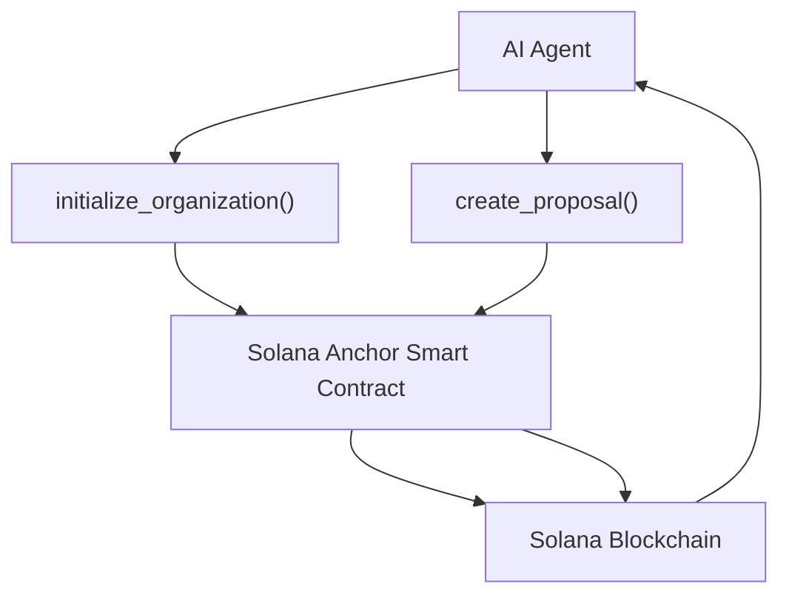

# Nestfolio - Technical Specification

- [User Stories](https://docs.google.com/document/d/17RCmnB56av2gCFnuXC1-FK5gN8O0iw_5GI_I_45z0C4/edit?usp=sharing)
- [LOI](https://docs.google.com/document/d/1ZQPu2TxbBhLUpNtphhLAHh3od6hKzoxPjCG04ynyfmo/edit?usp=sharing)
- [Arch Diagrams](https://docs.google.com/document/d/187Y3Kyx5x9pkQKORfxurYicBLcGn-1ZUo9evkm4ep-4/edit?usp=sharing)


## Core Functions & Work Distribution

### Team Member 1 [Avhi](https://github.com/AvhiMaz) : Core Infrastructure & Treasury
#### 1. Organization Management
- `initialize_organization()`
  - Create new DAO instance
  - Set initial parameters
  - Initialize treasury
  - Required deposit: 10 SOL
  - Features to use SPL Tokens

- `update_organization_settings()`
  - Update voting thresholds (checks the voter's voting powers based on the NFT holdings or stake deposits)
  - Limit for proposals

- `emergency_pause()`
  - Halt all operations
  - Time-locked resumption

#### 2. Treasury Operations
- `deposit_funds()`
  - Accept SOL/SPL tokens
  - Update treasury balance
  - Emit deposit events
  - Anyone can call it and deposit tokens to an Organization , `nft_mint` will be called + voting power increases

- `withdraw_funds()`
  - Time-locked withdrawals
  - Transaction logging

- `distribute_rewards()`
  - Calculate reward shares by number of up_votes and down_votes
  - Multi-sig authorization
  - Process distributions
  - Update balances


### Team Member 2 [Amal](https://github.com/amalkanhangad): Proposal & Voting System
#### 3. Proposal Management
- `create_proposal()`
  - Set proposal parameters
  - Define funding requests
  - Set voting duration
  - Add proposal metadata

#### 4. Voting Mechanics
- `cast_vote()`
  - Record vote
  - Update vote counts
  - Calculate voting powers
  - Rewards with a NFT to show on chain proof of voting

- `delegate_vote()`
  - Transfer voting rights (transfer the NFT )
  - Set delegation period

- `revoke_delegation()`
  - Cancel delegation
  - Reclaim voting power
  - Update records

- `query_vote_results()`
  - Calculate current status
  - Generate vote analytics
  - Project outcomes

### Team Member 3 [Arjun](https://github.com/4rjunc): Member Management and AI
#### 5. Member Operations
- `register_member()`
  - Create member account
  - Set initial reputation
  - Assign roles
  - Call NFT mint

- `stake_tokens()` ?
  - Lock tokens
  - Calculate voting power
  - Set lock duration

- `unstake_tokens()` ? 
  - Process withdrawals
  - Apply penalties
  - Update status

#### 6. Utils Functions 
- `nft_mint()`
  - called during `cast_vote`/ `register_member`

#### 7. AI agent  




#### 9. Expirimental/Additional Features 
- Do some research on cross-chain deposits : deposite ETH tokens on SOL

## Account Structures

```rust
#[account]
pub struct Organization {
    pub name: String,
    pub treasury_balance: u64,
    pub total_members: u32,
    pub created_at: i64,
    pub status: OrganizationStatus,
    pub proposal_limit: u32,
    pub member_registration_fee: u64, // Fee required to join the organization (in lamports)
    pub minimum_deposit_amount: u64,  // Minimum deposit (stake) required to become a member (in lamports)
    pub org_bump: u8,
}

#[account]
pub struct Proposal {
    pub title: String,
    pub description: String,
    pub proposer: Pubkey,
    pub up_votes: u32,
    pub down_votes: u32,
    pub status: ProposalStatus,
    pub expiry_time: i64,
    pub organization: Pubkey,
    pub proposal_bump: u8,
}

#[account]
pub struct Member {
    pub address: Pubkey,
    pub reputation: Pubkey[],
    pub staked_amount: u64,
    pub voting_power: u32, // Its 1 if the member registers in DAO, 2 if member deposit the minimum_deposit_amount
    pub joined_at: i64,
}
```
### Status Enums
```rust
#[derive(AnchorSerialize, AnchorDeserialize, Clone, PartialEq, Debug)]
pub enum ProposalStatus {
    Active,
    Approved,
    Rejected,
    Canceled,
}

#[derive(AnchorSerialize, AnchorDeserialize, Clone, PartialEq, Debug)]
pub enum OrganizationStatus {
    Active,
    InActive
}
```

## Integration Points

### Cross-Module Communication
1. Treasury → Proposal
   - Fund validation
   - Balance checks
   - Reward distribution

2. Voting → Security
   - Permission checks
   - Spam prevention
   - Vote validation

3. Member → Treasury
   - Stake management
   - Reward claims
   - Balance updates

## Development Timeline

### Week 1-2: Core Infrastructure
- Organization setup
- Basic treasury
- Account structures

### Week 3-4: Governance Features
- Proposal system
- Voting mechanics
- Member management

### Week 5-6: Security & Integration
- Security features
- Analytics
- UI integration

### Week 7-8: Testing & Deployment
- Unit tests
- Integration tests
- Security audit
- Deployment

## Testing Requirements
1. Unit Tests
   - Individual function testing
   - Edge case validation
   - Error handling

2. Integration Tests
   - Cross-module communication
   - State management
   - Transaction flow

3. Security Tests
   - Penetration testing
   - Stress testing
   - Vulnerability assessment

## Documentation Requirements
- Inline code documentation
- API documentation
- User guides
- Technical specifications

## Future Roadmap
1. Phase 2 Features
   - Cross-chain integration
   - Advanced analytics
   - Mobile app support

2. Phase 3 Features
   - AI governance
   - Automated proposals
   - Advanced treasury management


